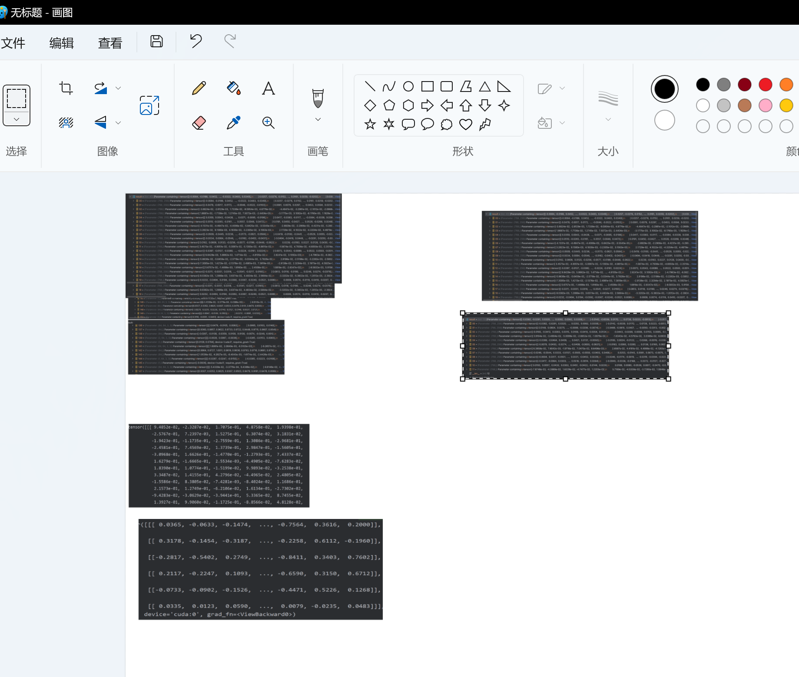

# 5.18 RNN踩坑记录

模型设计思路：

Re-ID特征过RNN对齐之后使用infoNCE计算loss，目前采用GRU

GRU参数：


模型设计思路：


infoNCE:相同目标对应到相同时刻的feature为正样本，不同目标的特征作为负样本


## pack_pad_sequence

所有的坑都要踩过一遍才能记住，之前室友就跟我讲使用RNN要留意这个，结果碰到了才想起来(笑)。

对于一个batch内包含不同长度的序列，首先使用pad_sequence将其转换为形状为【B, L, D】的张量。如果只使用pad_sequence将0填充，则计算的时候会使用pad的0计算：


因此需要将其转换为PackedSequence防止pad的0参与计算。


```python
 # 变长序列输入到RNN之前必须pack
from torch.nn.utils.rnn import pack_padded_sequence
padded_tk_tracks = pack_padded_sequence(x, lengths, batch_first=True, enforce_sorted=False)
```


## num_layers

更为奇葩的问题是训练之后我的RNN对于不同batch的input的输出完全一致，甚至给一个随机的值都完全一致，真是见了鬼了。

结果最后才发现我推理的时候设置的num_layers为8，而训练时是3，直接导致后5层是没训练的，绷不住了。

**模型的参数最好由配置文件给出，避免在训练和推理环节出现参数不一致情况，这种bug根本查不出来！！**


最后记录一下画图debug，debug的一天




