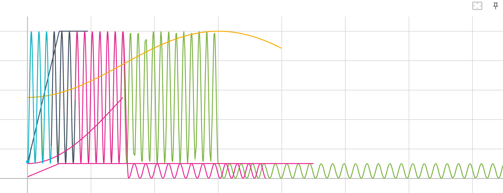
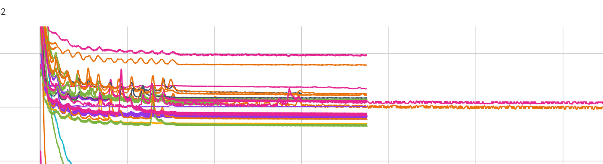
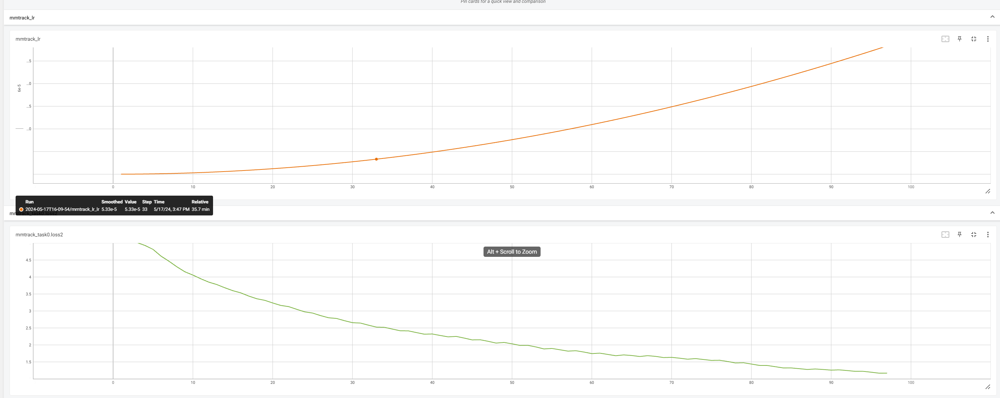

# 5.17debug日记

两个师兄一起帮我给代码做了一遍内科手术，直接把病入膏肓的代码给救回来不少


## dataset_wrapper

CBGS给的sample_indices是乱序的，导致输入的数据scenes_new也是乱序的，拿来训RNN简直是灾难，模型学个锤子。

```python
 scenes_new = [[] for _ in range(scenes_num)]
        for sample_indice in sample_indices:

            for i in range(scenes_num):
                if sample_indice in self.scenes[i]:
                    scenes_new[i].append(sample_indice)
```

解决方法：改为self.scenes

```python
scenes_new = self.scenes
```


## learning_rate

才发现之前lr都是完全错误的，我说我的loss怎么这么爱蹦迪



正确的余弦退火：橙色

我之前的余弦退火：其他颜色


导致的结果为loss蹦迪



原因：

```python
dict(
    type='CosineAnnealingLR',
    T_max=max_epochs*0.4,
    eta_min=lr * 10,
    begin=0,
    end=max_epochs*0.4,
    by_epoch=True,
    convert_to_iter_based=True),
dict(
    type='CosineAnnealingLR',
    T_max=max_epochs*0.6,
    eta_min=lr * 1e-4,
    begin=max_epochs*0.4,
    end=max_epochs,
    by_epoch=True,
    convert_to_iter_based=True),
```

tmax没改，不是8，12，而是max_epochs\*0.4, max_epochs\*0.6


改完之后loss下降的如德芙一般丝滑




## normalize

正则化要在计算相似度之前进行，不能在输入RNN之前进行，要保证训练和推理过程中的forward完全一致

```python
import torch.nn.functional as F
F.normalize(loss_features, dim=-1, p=2)
```

