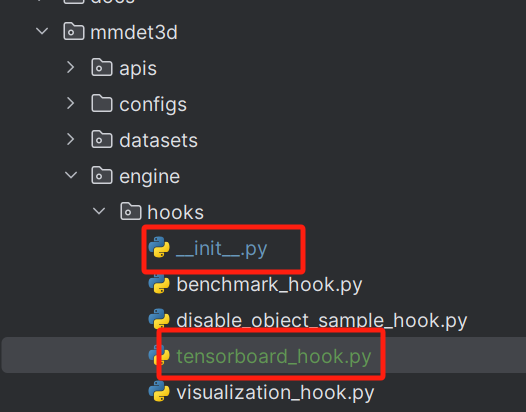
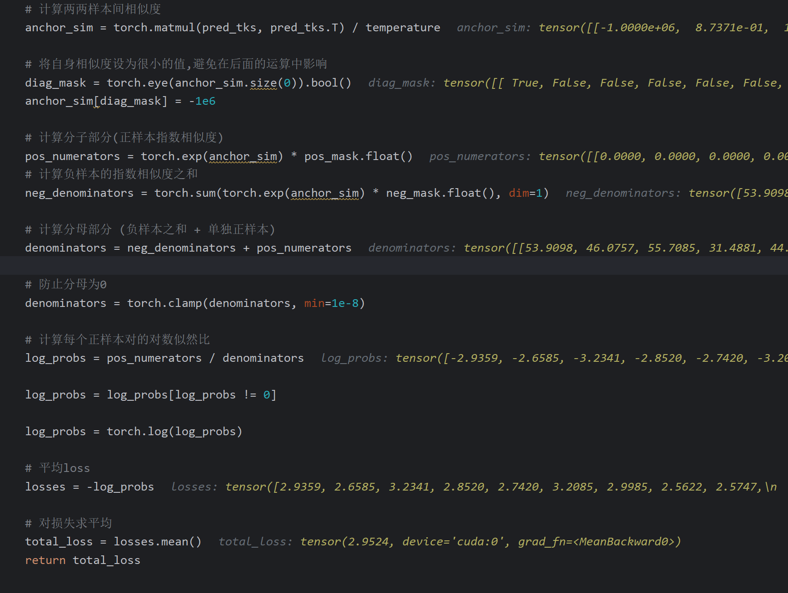

3.20

成功实现tensorboard在服务器的搭建

命令：

1. 端口映射：

   ```
   ssh -L 16666:127.0.0.1:6666 root@[ip] -p [端口]
   ```

2. tensorboard开启：

   ```
   tensorboard --logdir="./runs/" --port=6666 --host=127.0.0.1
   ```

3. 配置文件中加hook

   ```python
   custom_hooks = [
       dict(type='TensorboardHook')
   ]
   ```

4. 写after_train_iter的逻辑代码

   ```python
       def after_train_iter(self,
                            runner,
                            batch_idx: int,
                            data_batch: DATA_BATCH = None,
                            outputs: Optional[dict] = None) -> None:
           self.summaryWriter = SummaryWriter("./runs/")
           tag, log_str = runner.log_processor.get_log_after_iter(
               runner, batch_idx, 'train')
   
           iter = tag['iter']
           self.summaryWriter.add_scalars("mmtrack", tag, tag["iter"])
   ```

5. 在init中注册

   


3.21

- 昨天发现目标的相似度矩阵全都是1，今天一看loss代码才发现，原来网上直接复制来的对比损失是和我需要的不一致，怪不得每次loss都是飞速下降至0
- 于是决定重新修改，借助poe的claude3（比3.5好用太多）帮助成功实现完整的矩阵运算代码（poe给的其实是不对的，但是其矩阵运算的思路帮我成功写出了所需的正确代码）
- 问答链接：https://poe.com/s/amRJHyFQlytEgKxuG3Jx



- 现在loss可以正常的下降，希望这次能训成功
